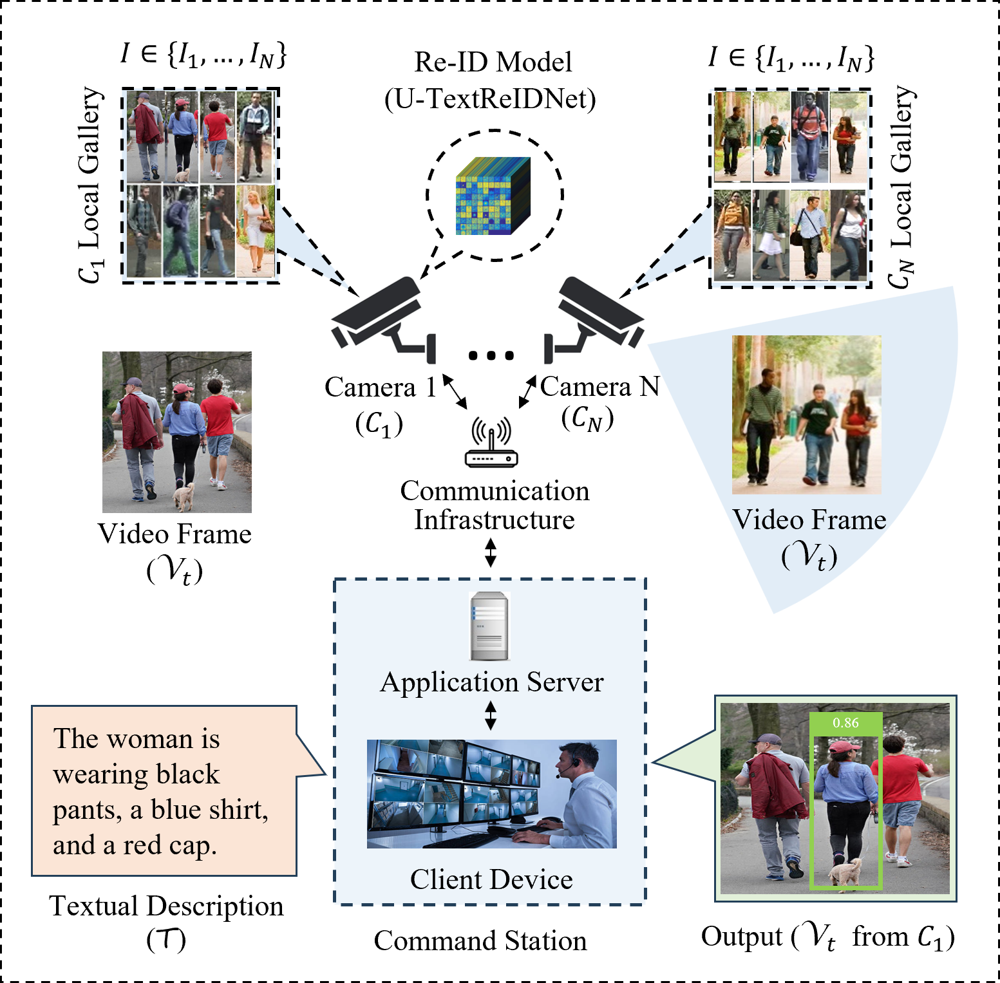

# Decentralized Text-Based Person Re-Identification in Multi-Camera Networks
This is the code repository for the paper titled **Decentralized Text-Based Person Re-Identification in Multi-Camera Networks**. The repository contains the implementation of U-TextReIDNet and its decentralized deployment in multi-camera networks. The prototype system addresses limitations in scalability, bandwidth usage, and processing bottlenecks typically found in traditional centralized systems by enabling person re-ID directly at the camera node level.

<br>

The architecture of the proposed decentralized system.

<br><br>
<br>
The screenshot of the prototype system (user application). The typos are deliberate. Please see reason in paper.


&nbsp;
## Requirements (dependencies)
### For Computer (Application Server) 
- Operating System: Ubuntu 20.04.6 LTS (irrelevant but worth mentioning)
- CUDA Version: 12.4
- python version: 3.8.10
- pytorch version: 1.13.1+cu117
- torchvision version: 0.14.1+cu117
- pillow version: 9.5.0
- opencv-python version: 4.8.1.78
- tqdm version: 4.66.1
- numpy version: 1.26.2
- natsort version: 8.4.0
- The remaining requirements are specified in [requirements.txt](requirements.txt)

## For Nvidia Jetson Nano
Download and use the [Ubuntu 20.04 OS image](https://github.com/Qengineering/Jetson-Nano-Ubuntu-20-image) from [Qengineering](https://github.com/Qengineering/Jetson-Nano-Ubuntu-20-image) to setup the operating system on the Jetson Nano device. The libraries provided by the Ubuntu 20.04 OS image should be sufficient, but where neccessary [install the dependencies](requirements.txt). The OS image comes pre-installed with the following:
- OpenCV 4.8.0
- Pytorch 1.13.0
- TorchVision 0.14.0
- TensorRT 8.0.1.6


&nbsp;
## Setup (dependencies)
## For Computer (Application Server) 
- Install dependencies. Complete list of dependencies is in ```requirements.txt```
- Download or clone DecentralizedTextReIDNet repository
- Navigate into TextReIDNet directory: ```cd /path/to/TextReIDNet```
- Download the pre-trained model [TextReIDNet_State_Dicts.pth.tar](https://drive.google.com/file/d/1iGRlscz0Vev_fDLswj_yqIWu7C8EoZGU/view?usp=sharing) and put it into ```TextReIDNet/data/checkpoints/TextReIDNet_State_Dicts.pth.tar```
- Read and modify the ```config.py``` to suit your system resources and requirements
