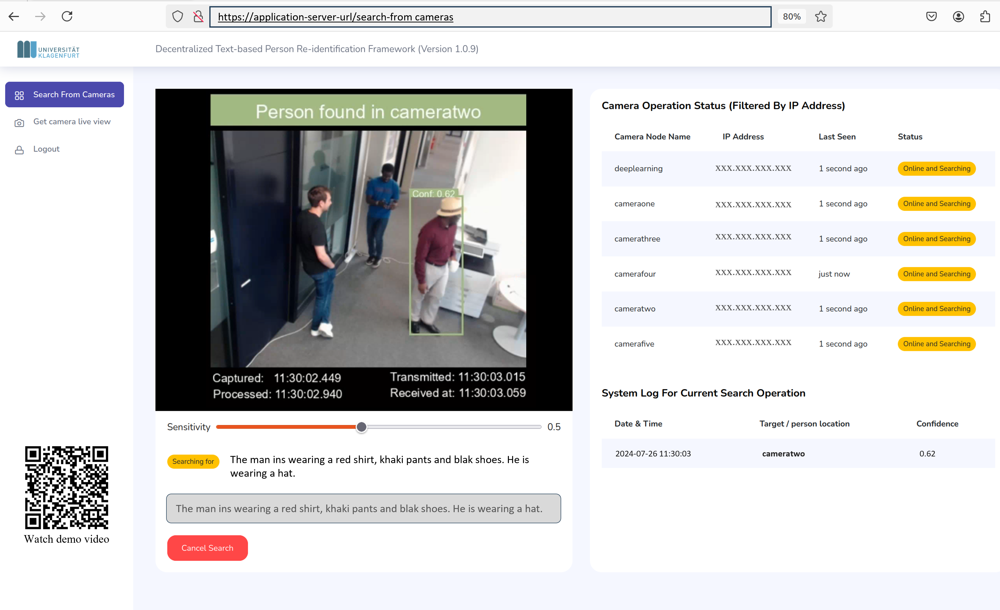

# Decentralized Text-Based Person Re-Identification in Multi-Camera Networks
This is the code repository for the paper titled **Decentralized Text-Based Person Re-Identification in Multi-Camera Networks**. The repository contains the implementation of U-TextReIDNet and its decentralized deployment in multi-camera networks. The prototype system addresses limitations in scalability, bandwidth usage, and processing bottlenecks typically found in traditional centralized systems by enabling person re-ID directly at the camera node level.

<br>

The architecture of the proposed decentralized system.


&nbsp;
## Software Dependencies
### For Computer (Application Server) 
- Operating System: Ubuntu 20.04.6 LTS (irrelevant but worth mentioning)
- CUDA Version: 12.4
- python version: 3.8.10
- pytorch version: 1.13.1
- torchvision version: 0.14.1
- pillow version: 9.5.0
- opencv-python version: 4.8.1.78
- tqdm version: 4.66.1
- numpy version: 1.26.2
- natsort version: 8.4.0
- The remaining requirements are specified in [requirements.txt](environment.yml)

### For Nvidia Jetson Nano
- OpenCV 4.8.0
- Pytorch 1.13.0
- TorchVision 0.14.0
- TensorRT 8.0.1.6


&nbsp;
## System Setup
### For GPU Computer (Application Server) 
- Install dependencies. Complete list of dependencies is in ```environment.yml```
- Download or clone DecentralizedTextReIDNet repository
- Navigate into DecentralizedTextReIDNet directory: ```cd /path/to/DecentralizedTextReIDNet```
- Download the [data](https://drive.google.com/drive/folders/1vGMhKj2hf_Kw286zi_exzX2FMTsISC9E?usp=sharing) folder and place it into as ```DecentralizedTextReIDNet/data```
- Read and modify the ```config.py``` file in ```DecentralizedTextReIDNet/config.py``` to suit your system resources and requirements

### For Camera Node (NVIDIA Jetson Nano) 
- Download and use the [Ubuntu 20.04 OS image](https://github.com/Qengineering/Jetson-Nano-Ubuntu-20-image) from [Qengineering](https://github.com/Qengineering/Jetson-Nano-Ubuntu-20-image) to setup the operating system on the Jetson Nano device. The libraries provided by the Ubuntu 20.04 OS image should be sufficient, but where neccessary [install the dependencies](environment.yml).
- Download or clone DecentralizedTextReIDNet repository
- Navigate into DecentralizedTextReIDNet directory: ```cd /path/to/DecentralizedTextReIDNet```
- Download the [data](https://drive.google.com/drive/folders/1vGMhKj2hf_Kw286zi_exzX2FMTsISC9E?usp=sharing) folder and place it into DecentralizedTextReIDNet as ```DecentralizedTextReIDNet/data```
- Read and modify the ```config.py``` file in ```DecentralizedTextReIDNet/config.py``` to suit your system resources and requirements


&nbsp;
## Inference
### On GPU Compuer (Application Server) 
- Do person identification on cropped images in a directory: <br> 
run ```python do_reid_on_cropped_person_images_in_directory.py```

- Do person identification on multi-person image: <br> 
run ```python do_reid_on_saved_multi_person_image.py```

- Do person identification on saved pedestrian video: <br> 
run ```python do_reid_on_saved_pedistrian_video.py```

- Do person detection on multi-person image: <br> 
run ```python human_detection_inference.py```

&nbsp;
## Decentralized Person Re-ID
- Setup the application server and camera node as described in the System Setup section
- Setup MySQL database system on the application server
- Create database with name ```decentralized```
- Use (upload) the database schema from ```DecentralizedTextReIDNet/data/database/decentralized.sql```
- Install ```Eclipse Mosquitto``` MQTT broker
- Edit the ```DecentralizedTextReIDNet/config.py``` file and makes changes to the ```Command Station Configuration``` section. In particular, set the IP address of the application server, eg. ```123.456.789.123```
- **On Application Server:** start Applicatition Server application: ```python DecentralizedTextReIDNet/surveillance_application/command_station_app.py ```
- Open a web browser and browse to ```http://123.456.789.123:5001```
- Log in to application. Default password: aau.at
- **On Camera Node (using saved pedesitrian video):** start ```python DecentralizedTextReIDNet/surveillance_application/camera_node_app_video.py``` this plays saved pedistrian video in a loop.
- **On Camera Node (using webcamera):** start ```python DecentralizedTextReIDNet/surveillance_application/camera_node_app.py```. This uses video feed from the camera.

<br>
<br>
The screenshot of the prototype system (user application) in use. The typos are deliberate. Please see reason in paper.


